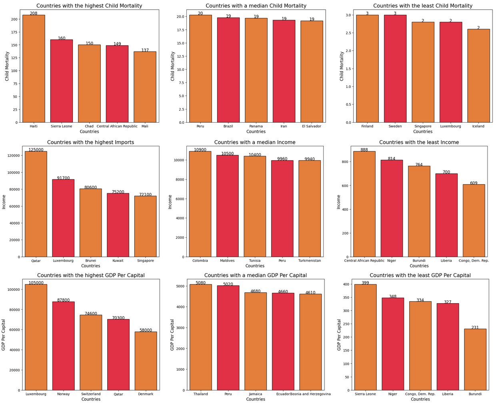
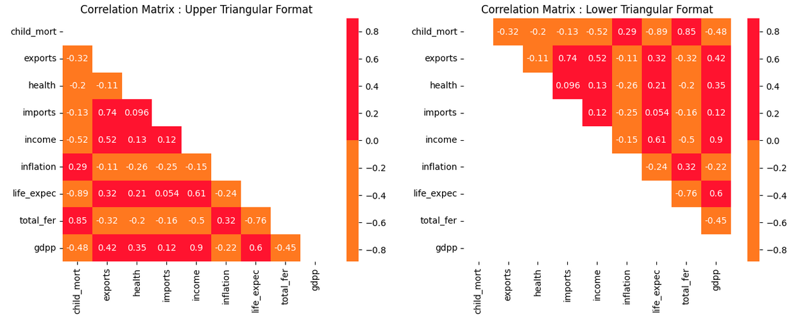
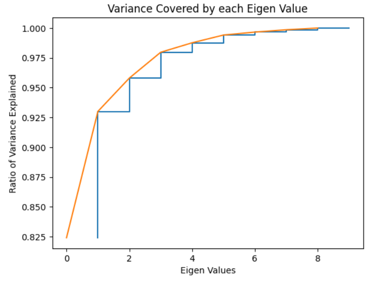
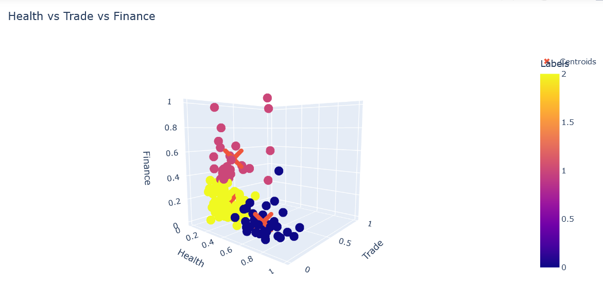
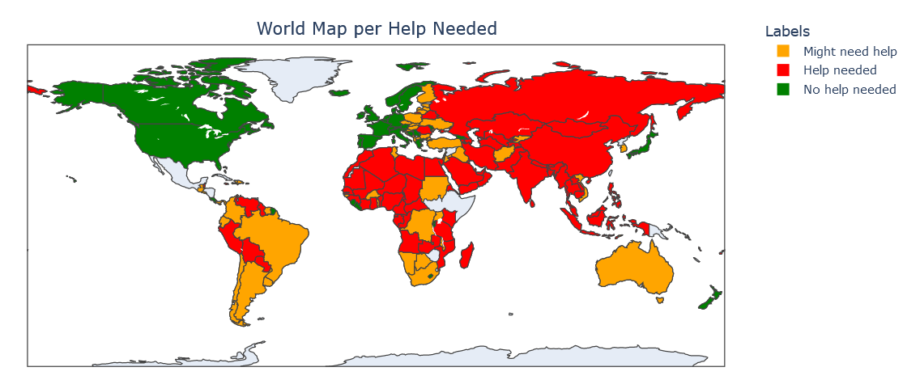
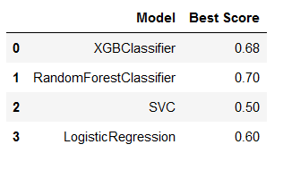

# Global Aid Assessment and Continent Classification 🌍

⛑️ A step-by-step guide for assessing aid to countries in need with some prediction. 🔍

    Author: Clément Cipriani
    Date: October, 2023
    Dataset: https://www.kaggle.com/datasets/rohan0301/unsupervised-learning-on-country-data

👋 Introduction

🌍 Presenting the "Global Aid Assessment and Continent Classification" Project! 🌟 Embark on a data-driven journey exploring worldwide challenges and opportunities. In the first branch, cutting-edge 🌐 clustering techniques categorize countries based on urgent international aid needs, utilizing a dynamic dataset covering GDPP, health, child mortality, and more. The classification branch delves into predicting continents for each country, unveiling patterns and relationships in socio-economic data through precise classifiers. 🔍 Ultimately, this project illuminates global challenges, guiding impactful aid efforts and providing insights into continent-shaping factors. 🌐💡

# Data Analysis

We will cover the multiple features of this dataset and analyse them to see if we can extract information off of them.

# Data Preprocessing

We will try to decipher whether the features are good enough to build a model based on them directly.

As you will be able to discover, we can do data engineering with the data to create new, easier to read, features.
We will also work with Principal Component Analysis, checking the explained variance for each eigen value.

# Model Creation

We will then build a K-Means Clustering model to check if we can accurately group the countries based on the features we created.

We will do so for the PCA features too and will compare the accuracy for each practice.
Then, since it is a real-world project, we will plot the results on a world map and see for ourselves the accuracy of K-Means.

# Continent Classification

Finally, I wanted to see whether we could try to accurately predict the continents for given countries. Since there are so many discrepancies between same continent country, it is not so viable. But we can actually get decent results with specific models.

